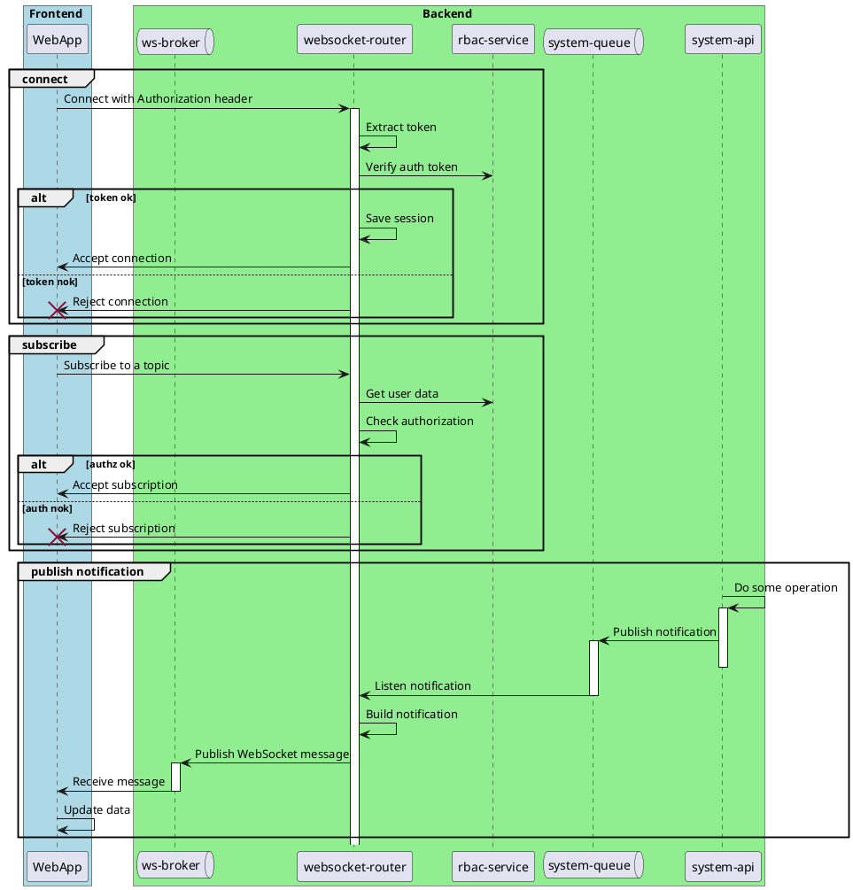

# Architecture Diagram

## Sequence Diagram

```plantuml
@startuml
box Frontend #LightBlue
participant WebApp as web
end box
box Backend #LightGreen
queue "ws-broker" as wsq
participant "websocket-router" as ws
participant "rbac-service" as rbac
queue "system-queue" as systemq
participant "system-api" as system
end box

group connect
web -> ws : Connect with Authorization header
activate ws
ws -> ws : Extract token
ws -> rbac : Verify auth token

alt token ok
ws -> ws : Save session
ws -> web : Accept connection
else token nok
ws -> web !! : Reject connection
end
end

group subscribe
web -> ws : Subscribe to a topic
ws -> rbac : Get user data
ws -> ws : Check authorization

alt authz ok
ws -> web : Accept subscription
else auth nok
ws -> web !! : Reject subscription
end
end

group publish notification
system -> system : Do some operation
activate system
system -> systemq : Publish notification
activate systemq
deactivate system
systemq -> ws : Listen notification
deactivate systemq
ws -> ws : Build notification
ws -> wsq : Publish WebSocket message
activate wsq
wsq -> web : Receive message
deactivate wsq
web -> web : Update data
end

@enduml
```