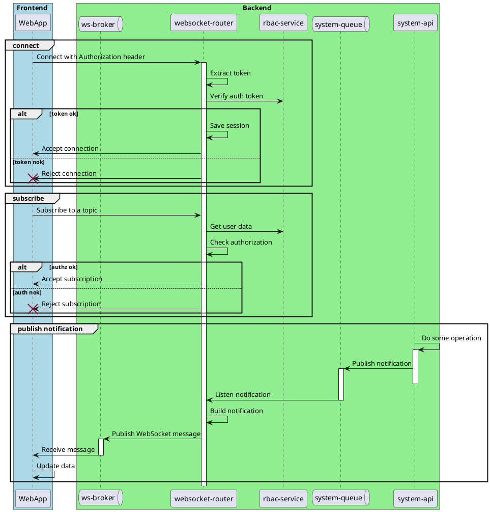

# Simple Websocket Service

A websocket service with STOMP protocol enhanced with Authentication and Authorization layer.

## Tech Stacks

1. Java 21 + Maven
2. Spring Boot 3.5.x
    - Spring Websocket (STOMP server)
3. RabbitMQ via Docker
    - Queue broker
    - STOMP broker

## Topic Naming Convention

Since we use RabbitMQ as the broker, we need to follow the topic naming convention.

1. Name cannot contain slash `/` like in the URL (RabbitMQ forbids it), except the prefixes.
2. Instead, we use dot `.` to separate the topic hierarchy.
    - e.g. `/topic/system.channel.123`
3. It has prefix names:
    - `/topic`: as broadcasting publisher
    - `/app`: as send entrypoint

## Start and Connect

### Prerequisites
1. Start RabbitMQ server
    ```bash
    docker-compose up -d
    ```
2. Start Mock server for RBAC
    - Can use Mockoon, the config file can be found in [rbac.json](mockoon/rbac.json)

### Start Server

1. Run RabbitMQ server
2. Run `Application.java`

#### Options

1. By default, the STOMP server will use simple broker.
    - To use RabbitMQ, set `app.websocket.broker.localtest.useSimple` to `true`

### Connect as Client

1. Prepare the STOMP/SockJS client.
2. Connect to `ws://localhost:8881/ws-connect` (adjust host and port if needed)
3. Subscribe to one of the topics.
    ```

## Security

1. Use token from RBAC to authenticate on `CONNECT` command. It, then, save the session for subsequent commands.
    - Put `Authorization: Bearer <token>` on STOMP header.
2. On `SUBSCRIBE` command, it will authorize by checking topic/destination URI against itemPath from RBAC.
3. In general, this layer can toggled by properties `app.websocket.auth.enabled`.

## Architecture Design



## Testing

We have a test client included in `resources/test.html`. It is based on JavaScript.

1. Open [test.html](src/main/resources/test.html) in browser.
2. Open developer console. Observe the log messages.
3. Add or delete topic subscriptions in the script.
4. Send Rabbit message from the RabbitMQ management console to trigger some topics.

NOTE: By default, it connects to HelloController and subscribe to it.
Also, it subscribes to an additional topic triggered by RabbitMQ queue.